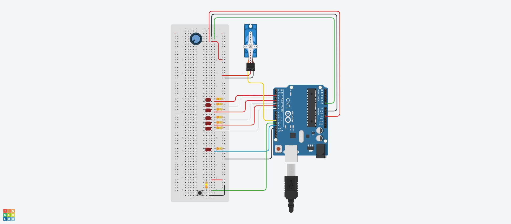

# Breathalyser with Arduino
## Made by Diogo/Arcadnus

Breathalyser made with the intent of locking down a car once it detects alcohol in the air.

Makes use of a servo motor to lock the keyslot of a car, impeding it to turn it on

